<h3><code>lucas@github ~ $ ./contributions.sh</code></h3>

  

<h3><code>lucas@github ~ $ whoami</code></h3>
<table>
  <tr>
    <td valign="top"></td>
    <td valign="top"></td>
  </tr>
</table>

 

## Projects

### iOS & macOS

| Project | Description | Stack |
|---------|-------------|-------|
| [TeeUp](https://github.com/SoldergG/TeeUp) | Golf companion app for Portugal — track rounds, discover courses, live stats | SwiftUI · Supabase · Overpass |
| [Flo](https://github.com/SoldergG/Flo) | Mindful productivity — tasks, habits, focus timer, AI assistant, journaling | SwiftUI · macOS |
| [KebabLocator-iOS](https://github.com/SoldergG/KebabLocator-iOS) | Find the best kebab spots near you with a premium map UI | SwiftUI · OSM · Supabase |
| [ai-chat-swift](https://github.com/SoldergG/ai-chat-swift) | Native iOS AI chat — Claude API, real-time streaming, conversation history | SwiftUI · Anthropic |
| [swift-ui-components](https://github.com/SoldergG/swift-ui-components) | SolderUIKit — reusable SwiftUI components: toasts, skeleton loaders, ratings, glass cards | SwiftUI · SPM |
| [swiftui-gallery](https://github.com/SoldergG/swiftui-gallery) | 35+ copy-paste SwiftUI components — like shadcn/ui for SwiftUI | SwiftUI · Next.js |

### Android

| Project | Description | Stack |
|---------|-------------|-------|
| [KebabLocator-Android](https://github.com/SoldergG/KebabLocator-Android) | Native Android kebab finder with interactive maps | Kotlin · Compose · Supabase |

### Web

| Project | Description | Stack |
|---------|-------------|-------|
| [espalha-ideias](https://github.com/SoldergG/espalha-ideias) | Rebuild of espalhaideias.pt (real client) with password-protected admin CMS | Next.js 16 · Supabase |
| [desporto-mais](https://github.com/SoldergG/desporto-mais) | Rebuild of desportomais.pt, sister brand of Espalha Ideias — sports management & water-safety services | Next.js · Supabase |
| [portfolio-v2](https://github.com/SoldergG/portfolio-v2) | Personal developer portfolio — 3D interactive hero, project showcase, smooth animations | Next.js 15 · Three.js |
| [expense-tracker](https://github.com/SoldergG/expense-tracker) | Personal finance dashboard with interactive charts and category tracking | Next.js 15 · Recharts · Supabase |
| [schema-visualizer](https://github.com/SoldergG/schema-visualizer) | Paste SQL → get an interactive ER diagram. Supports PostgreSQL & Supabase | Next.js · React Flow |
| [procura-escola](https://github.com/SoldergG/procura-escola) | University & school finder for Portugal — grades, fees, employability | Next.js · Tailwind |
| [lisbon-dashboard](https://github.com/SoldergG/lisbon-dashboard) | Lisbon city stats — live weather, metro status, air quality, tourism charts | Next.js 15 · Recharts |
| [home-radar](https://github.com/SoldergG/home-radar) | Home network dashboard — device tracking, security monitoring, radar UI | Next.js · TypeScript |
| [qr-menu](https://github.com/SoldergG/qr-menu) | QR code digital menu system for restaurants | Next.js 15 |
| [solar-calc-v2](https://github.com/SoldergG/solar-calc-v2) | Solar panel ROI calculator for Portugal — 3D house scene, production chart, CO₂ tracker | Next.js 15 · Three.js |
| [TerrainCalc](https://github.com/SoldergG/TerrainCalc) | Satellite terrain measurement — area, distance & radius from satellite imagery | React · Three.js · Leaflet |
| [sushi-tracker](https://github.com/SoldergG/sushi-tracker) | Track sushi sessions, score dishes, share with friends | React Native · Expo |

### UI Experiments

| Project | Description | Stack |
|---------|-------------|-------|
| [aurora-landing](https://github.com/SoldergG/aurora-landing) | Aurora borealis animated landing page | Next.js 15 · Canvas |
| [particle-text](https://github.com/SoldergG/particle-text) | Interactive canvas particle text — words dissolve and reform with mouse repulsion | Next.js 15 |
| [morphing-shapes](https://github.com/SoldergG/morphing-shapes) | SVG blob morphing backgrounds with glassmorphism UI | Next.js 15 |
| [magnetic-ui](https://github.com/SoldergG/magnetic-ui) | Magnetic cursor hover effects on buttons and cards | Next.js 15 |
| [scroll-cinema](https://github.com/SoldergG/scroll-cinema) | Scroll-driven cinematic reveal animations and storytelling | Next.js 15 |

### Tools & APIs

| Project | Description | Stack |
|---------|-------------|-------|
| [devtools-cli](https://github.com/SoldergG/devtools-cli) | Developer CLI — colour converter, commit helper, project scaffolder | TypeScript · Node.js |
| [kebab-api](https://github.com/SoldergG/kebab-api) | REST API powering KebabLocator — geospatial nearby search, reviews, rate limiting | Node.js · Supabase · PostGIS |
| [claude-code-config](https://github.com/SoldergG/claude-code-config) | Personal Claude Code config — custom status line, 25 skills, settings, plugins & MCP | Python |
| [dotfiles](https://github.com/SoldergG/dotfiles) | macOS dotfiles for iOS & web development — zsh config, git aliases, Brewfile | Shell |
| [transcript](https://github.com/SoldergG/transcript) | Audio & video transcription tool | TypeScript |

 

